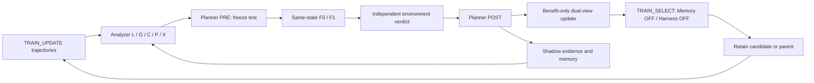

# Method and implementation map

The scientific question is whether a plausible repair first improves an executed
continuation and then becomes capability retained by an unassisted task policy.

L analyzes local evidence; G identifies grouped mechanisms; C develops component
and capability hypotheses; P deterministically assembles the policy profile;
X checks support and counterevidence. PRE selects a principal bottleneck and
registers interventions before seeing their effects. POST interprets fixed
verifier outputs and routes eligible training and research lessons. The next
round reads admitted history only after closure.

The base implementation is under `src/pchsi/` and the exact historical execution
core is the `package-123e43da6811` snapshot in `runtime/packages/`. The current
validation is `MAX10_V2_1_1_EXECUTABLE_PLANNER_VALIDATION-0c20fc82ebc2`:

- `strategy_planner.py`: source review and executable coverage in PRE.
- `guarded_strategy.py`, `cue_strategy.py`: bounded public-state interventions.
- `strategy_worker.py`, `strategy_gpu.py`: existing environment/worker integration.
- `strategy_hooks.py`: verified strategy into native training materialization.
- `bounded_pre.py`, `pool_context.py`, `lossless_context.py`: registered bounded
  request construction and deduplicated evidence context.
- `one_validation.py`, `entry_v208.py`: one reused-evidence validation entry.
- `runtime_setup.py`, `native_preflight.py`: typed runtime setup and checks.

Package files are preserved rather than silently rewritten as a portable runner.
Their exact manifests and source origins are listed in the source index. The
single-seed recovery package and V194 selection implementation accompany the
validation: the older independent entry initially bypassed that seed policy.

Terminal B/H/N/U stays separate from process progress. Benefit requires at least
four of five valid F0-fail/F1-success pairs and no reverse pair. Progress-positive
neutral examples remain research-only. Current training uses one initial-action
view and one strategy view per Benefit source; it does not supervise every action
of the successful intervention program. Selection uses success count first,
terminal goal-condition fraction on ties, then retains the parent if no improvement.
The final 134 unseen / 140 seen benchmark never supplies adaptive selection data.
